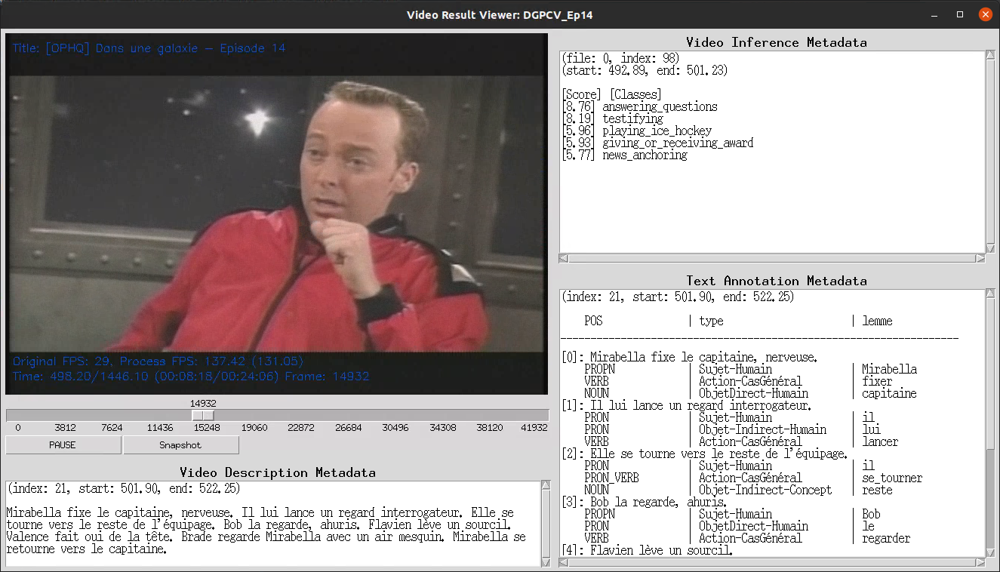

# video-result-viewer

![version][version-badge] [![license][license-badge]](./LICENSE)

[version-badge]: https://img.shields.io/badge/version-1.5.1-blue
[license-badge]: https://img.shields.io/badge/license-%20CC%20BY--NC--SA%204.0-blue

Minimalistic video player that allows visualization, easier interpretation and analysis of synchronized metadata
from [FrVD][FrVD] dataset annotations and corresponding video files.

[FrVD]: https://github.com/crim-ca/FrVD

## Description

Please refer to `--help` option of the [tool's viewer script](./source/viewer.py) for all available options.
See also the [usage details](./doc/usage.md) for information about available features.

### Public Use

The tool employs the following components as input:

- \[required]: Original video file (production)
- \[required]: Metadata annotation file from the relevant video in [FrVD][FrVD] dataset.

### Internal Use by CRIM

Following files are employed to generate metadata provided by [FrVD][FrVD]. They are accessible only internally.

The tool takes as input the following information and displays them for corresponding timestamps.

- \[required] Original video file (production)
- \[optional] Extracted video-description annotations metadata (as generated by [FAR-VVD/data-extraction][metadata_extract])
- \[optional] Video action inference results (as generated by [FAR-VVD/video-action-recognition][video_infer])
- \[optional] Text subjects and verbs results (as generated by [FAR-VVD/Annotation-VD][text_results])

[metadata_extract]: https://www.crim.ca/stash/projects/FAR/repos/data-extraction/
[text_results]: https://www.crim.ca/stash/projects/FAR/repos/annotation-vd/
[video_infer]: https://www.crim.ca/stash/projects/FAR/repos/video-action-recognition/

It can also combine all of those results into a [merged file](doc/usage.md#metadata-merging)
(i.e.: annotations of [FrVD][FrVD]) with aligned timestamps.

**NOTE**  
Further options are available using the CLI script.

## Changes

Please refer to [Change History](CHANGES.md) for any updates relative to the code or metadata adjustments.

## Expected Formats of Metadata

Please refer to [format details](./doc/metadata_format.md).

## Installation and Execution

Please refer to [usage details](./doc/usage.md#Installation).
